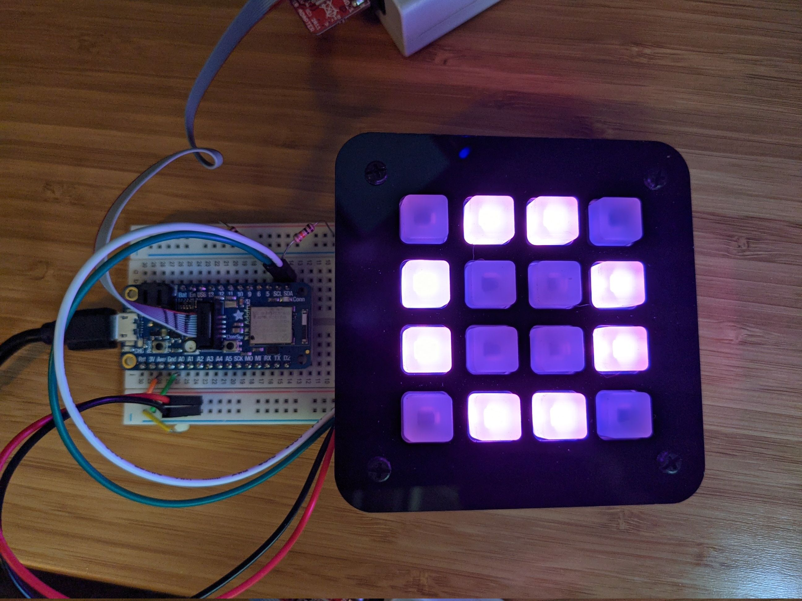

# neotrellis-rgb

Provides an embedded-hal I2C driver for the [Adafruit NeoTrellis RGB](https://www.adafruit.com/product/3954) key grid. This code is derived from the [Adafruit Seesaw](https://github.com/adafruit/Adafruit_Seesaw) repository but specialized for the use case of a [simple, singular NeoTrellis configuration](https://github.com/adafruit/Adafruit_Seesaw/blob/master/examples/NeoTrellis/basic/basic.ino).

Having multiple NeoTrellis boards linked is currently unsupported due to the single Neotrellis structure consuming the I2C structure. If you would like this feature, pull requests are encouraged.

The Adafruit Seesaw board requires delays between writes and reads. The application that I built this for is a synthesizer which cannot support such delays synchronously, so I split out each write/read combo so that they could be used independently or with the more convenient call with delays.

Documentation is sparse; please see [the working example](examples/nrf52840/basic.rs) for usage.
